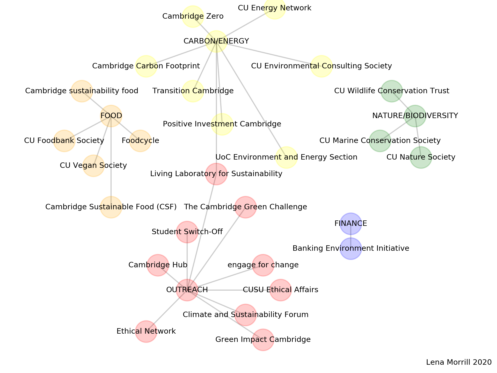

## What are the intiatives for tackling climate change/ making the University of Cambridge more sustainable?

<!---  --->

To see the interactive plot, click [here](https://lm687.github.io/sustainable_uni_of_cam/html_files.html)

Source files are:

```
dataframe_edges.txt 
metadata.txt
url_figures.txt
```


## FAQ
- *What is this map?*

- *Can I add my project to this map?*

- *Some information is incorrect, how can I let you know?*

- *Can I share this map?*
