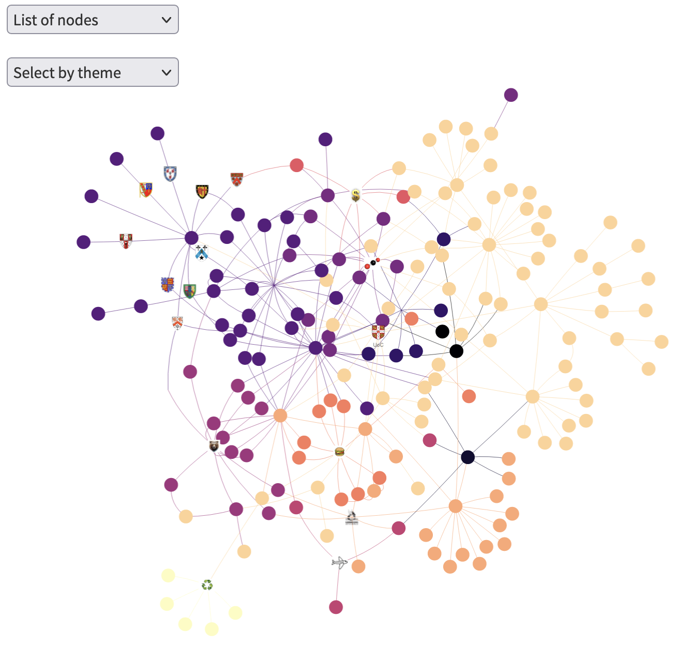

## What are the intiatives for tackling climate change/ making the University of Cambridge more sustainable?

<!---  --->


To see the current version of the interactive plot, click [here](https://lm687.shinyapps.io/code/)

To see the previous version of the interactive plot, click [here](https://lm687.github.io/sustainable_uni_of_cam/html_files.html)




## FAQs
- **What is this map?**

This graph/mind map is an attempt to put together all the major initiatives related to sustainability (on energy consumption and sources, wildlife conservation, waste management, and other topics), and how they relate to each other, in Cambridge, UK. We focus mostly on initiatives at the University of Cambridge, but how much we want to widen the map to all Cambridge is still an ongoing discussion!

- **Can I add my project to this map?**

Let us know of your project by opening an [issue](https://github.com/lm687/sustainable_uni_of_cam/issues) and we'll do our best to include it!

- **Some information is incorrect, how can I let you know?**

We're grateful for any feedback! As before, please let us know of any errors in the map by opening an [issue](https://github.com/lm687/sustainable_uni_of_cam/issues).

- **Can I share this map?**

Yes please!


- **Can I help create this map?**

Additions to the map, and possible collaborations, are very welcome. You can open an [issue](https://github.com/lm687/sustainable_uni_of_cam/issues) expressing your interest in helping develop the map and we'll contact you.

## Technical details
The source files are:

```
dataframe_edges.txt
metadata.txt
url_figures.txt
```

To deploy the shiny app, from rstudio, and within the `code/` folder, do
```
rsconnect::deployApp()
rsconnect::showLogs(streaming = TRUE)
```

note that there should be no `rstudioapi()` bits in the code
