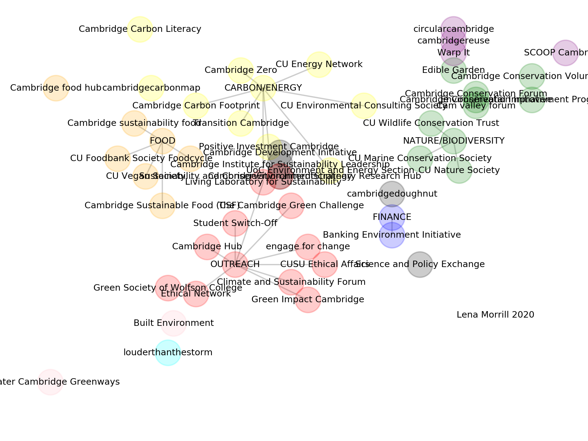

## What are the intiatives for tackling climate change/ making the University of Cambridge more sustainable?

<!---  --->

To see the interactive plot, click [here](https://lm687.github.io/sustainable_uni_of_cam/html_files.html)

Source files are:

adjacency_matrix.numbers (and adjacency_matrix.csv)
colours.txt
